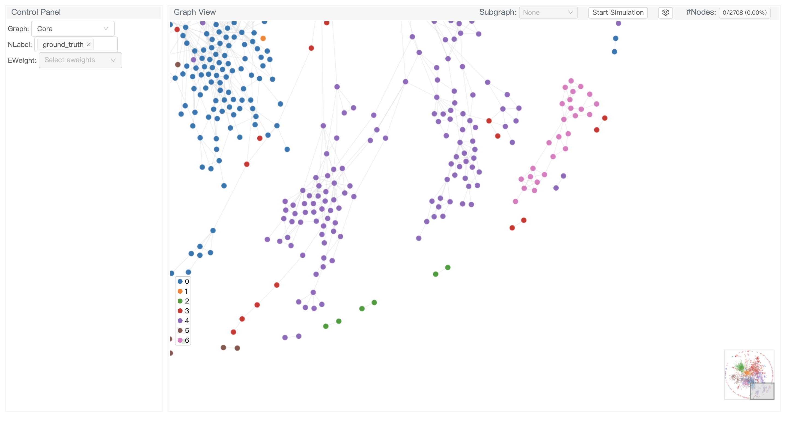

GNNLens2 is an interactive visualization tool for graph neural networks (GNN). It allows seamless integration with [deep graph library (DGL)](https://github.com/dmlc/dgl) and can meet your various visualization requirements for presentation, analysis and model explanation. It is an open source version of [GNNLens](https://arxiv.org/abs/2011.11048) with simplification and extension.

A **video demo** is available [here](https://www.youtube.com/watch?v=eBI_lyzsg3M). Switch the video quality for the best viewing experience.

## Installation

### Requirements

- [PyTorch](https://pytorch.org/)
- [DGL](https://www.dgl.ai/pages/start.html)
- Flask-CORS

You can install Flask-CORS with

```bash
pip install -U flask-cors
```

### Installation for the latest stable version

```bash
pip install gnnlens
```

### Installation from source

If you want to try experimental features, you can install from source as follows:

```bash
git clone https://github.com/dmlc/GNNLens2.git
cd GNNLens2/python
python setup.py install
```

### Verifying successful installation

Once you have installed the package, you can verify the success of installation with

```python
import gnnlens

print(gnnlens.__version__)
# 0.1.0
```

## Tutorials

We provide a set of tutorials to get you started with the library:
- [Tutorial 1: Graph structure](resources/tutorials/tutorial_1_graph.md)
- [Tutorial 2: Ground truth and predicted node labels](resources/tutorials/tutorial_2_nlabel.md)
- [Tutorial 3: Edge weights and attention](resources/tutorials/tutorial_3_eweight.md)
- [Tutorial 4: Weighted subgraphs and explanation methods](resources/tutorials/tutorial_4_subgraph.md)

## Team

**HKUST VisLab**: [Zhihua Jin](https://github.com/jnzhihuoo1), [Huamin Qu](http://huamin.org/)

**AWS Shanghai AI Lab**: [Mufei Li](https://github.com/mufeili), [Wanru Zhao](https://github.com/Ryan0v0) (work done during internship), [Jian Zhang](https://github.com/zhjwy9343), [Minjie Wang](https://jermainewang.github.io/)

**SMU**: [Yong Wang](http://yong-wang.org/)
