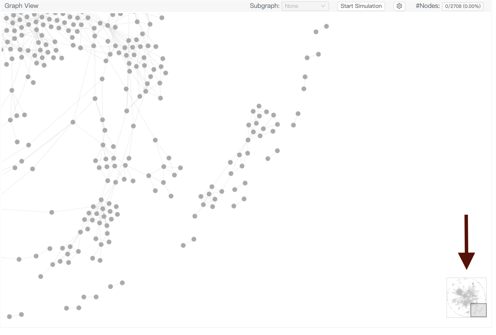

# Tutorial 1: Graph structure

Graph structure plays a critical role in developing a GNN. You may want to visualize the whole graph to roughly understand the sparsity of it and if it has subgraphs of a particular pattern.

GNNLens2 allows you to do it using a simple API with very little effort.

## Data preparation

First we load DGL’s built-in Cora and Citeseer dataset and retrieve their graph structures.

```python
from dgl.data import CoraGraphDataset, CiteseerGraphDataset

cora_dataset = CoraGraphDataset()
cora_graph = cora_dataset[0]
citeseer_dataset = CiteseerGraphDataset()
citeseer_graph = citeseer_dataset[0]
```

Next, we need to dump the graph structures to a local file that GNNLens2 can read. GNNLens2 provides a built-in class `Writer` for this purpose. You can add an arbitrary number of graphs, one at a time. 

Once you finish adding data, you need to call **writer.close()**.

```python
from gnnlens import Writer

# Specify the path to create a new directory for dumping data files.
writer = Writer('tutorial_graph')
writer.add_graph(name='Cora', graph=cora_graph)
writer.add_graph(name='Citeseer', graph=citeseer_graph)
# Finish dumping
writer.close()
```

## Launch GNNLens2

To launch GNNLens2, run the following command line.

```bash
gnnlens --logdir tutorial_graph
```

By entering `localhost:7777` in your web browser address bar, you can see the GNNLens2 interface like below. `7777` is the default port GNNLens2 uses. You can specify an alternative one by adding `--port xxxx` after the command line and change the address in the web browser accordingly.

## GNNLens2 Interface

<p align="center">
  
</p>

The interface is empty as no graph is selected. The control panel on the left has multiple selectors for users to make selections. The first selector is the graph selector. You can click it and select a graph to visualize from the drop-down list. The options in the drop-down list are the names you passed to `add_graph`.

<p align="center">
  
</p>

After you select a graph, GNNLens2 will plot the corresponding graph as below. GNNLens2 determines the graph layout (node positions) on the fly using a force-directed graph drawing algorithm. The algorithm simulates the physical forces on nodes. The simulation stops when you click the “Stop Simulation” button and starts when you click the same button again.

<p align="center">
  
</p>

For a large graph, you can view different parts of it by clicking on the overview box at the lower-right corner.

<p align="center">
  
</p>

You can drag the graph by pressing and holding the mouse button. The figure below is the result of dragging the graph to the right.

<p align="center">
  
</p>

You can also zoom in or out on the graph. The figure below is the result of zooming in on the graph.

<p align="center">
  
</p>

As you move the cursor to a particular node, GNNLens2 will display its node ID and highlight its one-hop neighborhood.

<p align="center">
  
</p>
