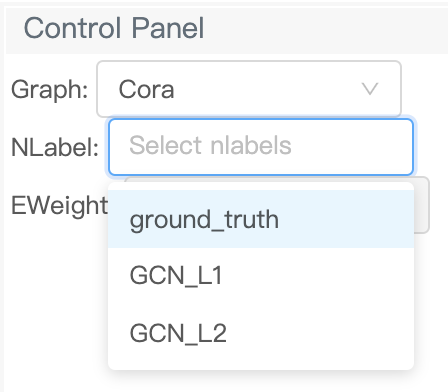

# Tutorial 2: Ground truth and predicted node labels

Each node in a graph can be associated with a label like its node type or node class. For the task of multiclass node classification, you can have ground truth node labels and node labels predicted from different models. GNNLens2 allows coloring nodes based on node labels in graph visualization and comparing node labels from different sources.

## Data preparation

First, we load DGL’s built-in Cora dataset and retrieve its graph structure, node labels (classes) and the number of node classes.

```python
from dgl.data import CoraGraphDataset

dataset = CoraGraphDataset()
graph = dataset[0]
nlabels = graph.ndata['label']
num_classes = dataset.num_classes
```

We dump them to a local file that GNNLens2 can read. Compared with [the previous section](./tutorial_1_graph.md), we additionally dump the node classes and the number of node classes. 

```python
from gnnlens import Writer

# Specify the path to create a new directory for dumping data files.
writer = Writer('tutorial_nlabel')
writer.add_graph(name='Cora', graph=graph, 
                 nlabels=nlabels, num_nlabel_types=num_classes)
```

Next, we train two graph convolutional networks (GCN) for node classification, `GCN_L1` (GCN with one layer) and `GCN_L2` (GCN with two layers). Once trained, we retrieve the predicted node classes and dump them to local files

```python
import torch
import torch.nn as nn
import torch.nn.functional as F
from dgl.nn.pytorch import GraphConv

# Define a class for GCN
class GCN(nn.Module):
    def __init__(self,
                 in_feats,
                 num_classes,
                 num_layers):
        super(GCN, self).__init__()
        self.layers = nn.ModuleList()
        self.layers.append(GraphConv(in_feats, num_classes))
        for _ in range(num_layers - 1):
            self.layers.append(GraphConv(num_classes, num_classes))

    def forward(self, g, h):
        for layer in self.layers:
            h = layer(g, h)
        return h

# Define a function to train a GCN with the specified number of layers 
# and return the predictions
def train_gcn(g, num_layers, num_classes):
    features = g.ndata['feat']
    labels = g.ndata['label']
    train_mask = g.ndata['train_mask']
    model = GCN(in_feats=features.shape[1],
                num_classes=num_classes,
                num_layers=num_layers)
    loss_func = nn.CrossEntropyLoss()
    optimizer = torch.optim.Adam(model.parameters(), lr=1e-2)
  
    num_epochs = 200
    model.train()
    for _ in range(num_epochs):
        logits = model(g, features)
        loss = loss_func(logits[train_mask], labels[train_mask])
        optimizer.zero_grad()
        loss.backward()
        optimizer.step()
      
    model.eval()
    predictions = model(g, features)
    _, predicted_classes = torch.max(predictions, dim=1)
    return predicted_classes

print("Training GCN with one layer...")
predictions_one_layer = train_gcn(graph, num_layers=1, num_classes=num_classes)
print("Training GCN with two layers...")
predictions_two_layers = train_gcn(graph, num_layers=2, num_classes=num_classes)
# Dump the predictions to local files
writer.add_model(graph_name='Cora', model_name='GCN_L1',
                 nlabels=predictions_one_layer)
writer.add_model(graph_name='Cora', model_name='GCN_L2',
                 nlabels=predictions_two_layers)
# Finish dumping
writer.close()
```

## Launch GNNLens2

To launch GNNLens2, run the following command line.

```bash
gnnlens --logdir tutorial_nlabel
```

By entering `localhost:7777` in your web browser address bar, you can see the GNNLens2 interface. `7777` is the default port GNNLens2 uses. You can specify an alternative one by adding `--port xxxx` after the command line and change the address in the web browser accordingly.

## GNNLens2 Interface

The second selector in the control panel on the left is the `NLabel` selector. After you select a graph and click the `NLabel` selector, it will display the available node labels from different sources. The options include `ground_truth` for the ground truth node labels and the model names passed to `add_model` for the model predictions.

<p align="center">
  
</p>

You can select an option to color nodes using a source of node labels. The color legend is in the lower left corner.

<p align="center">
  
</p>

The node coloring also applies to subgraphs if you click on a node.

<p align="center">
  
</p>

You can even select multiple options and simultaneously color nodes using multiple sources of node labels. In this case, the circles representing the nodes will be replaced by glyphs. The center of the glyph is colored based on the first selected  `NLabel`  source. The outer pie chart will be colored based on the rest  `NLabel`  sources in a clockwise direction from the top. This allows a direct comparison among the ground truth node labels and the predicted node labels from various models.

<p align="center">
  
</p>

To terminate GNNLens2, use `ctrl + c`.

## Next

So far, we've seen how to visualize node labels. Now let us look at how to [use edge weights in visualization](./tutorial_3_eweight.md). 
