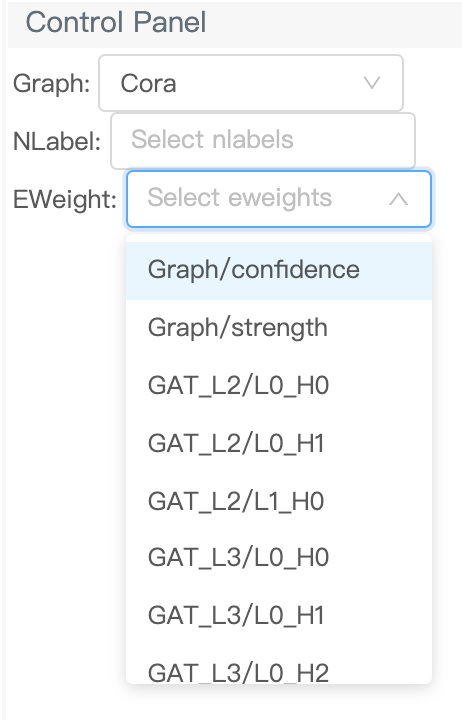
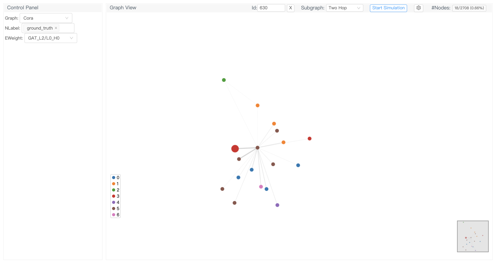

# Tutorial 3: Edge weights and attention

The edges in a graph can be associated with a weight, e.g., connectivity strength. Attention-based graph neural networks like graph attention networks (GATs) have been widely used and we can also view learned attention weights as edge weights. GNNLens2 allows visualizing the edge weights like attention weights in a GAT in graph visualization.

## Data preparation

First, we load DGL’s built-in Cora dataset and retrieve its graph structure, node labels (classes) and number of node classes.

```python
from dgl.data import CoraGraphDataset

dataset = CoraGraphDataset()
graph = dataset[0]
nlabels = graph.ndata['label']
num_classes = dataset.num_classes
```

As the Cora graph is not weighted, we generate two types of random edge weights for demonstration purposes. The edge weights are expected to be in range `[0, 1]`.

```python
import torch

confidence = torch.rand(graph.num_edges(),)
strength = torch.rand(graph.num_edges(),)
```

We dump them to a local file that GNNLens2 can read.

```python
from gnnlens import Writer

# Specify the path to create a new directory for dumping data files.
writer = Writer('tutorial_eweight')
writer.add_graph(name='Cora', graph=graph, 
                 nlabels=nlabels, num_nlabel_types=num_classes,
                 eweights={'confidence': confidence, 'strength': strength})
```

Next, we train two graph attention networks (GAT) for node classification, `GAT_L2` (GAT with two layers) and `GAT_L3` (GAT with three layers). Once trained, we retrieve the attention weights and dump them to local files.

```python
import torch
import torch.nn as nn
import torch.nn.functional as F

import dgl.function as fn
from dgl.nn import GATConv

class GAT(nn.Module):
    def __init__(self,
                 num_layers,
                 in_dim,
                 num_hidden,
                 num_classes,
                 heads):
        super(GAT, self).__init__()
        self.num_layers = num_layers
        self.gat_layers = nn.ModuleList()
        # input projection (no residual)
        self.gat_layers.append(GATConv(in_dim, num_hidden, heads[0]))
        # hidden layers
        for l in range(1, num_layers - 1):
            # due to multi-head, in_dim = num_hidden * number of heads in the previous layer
            self.gat_layers.append(GATConv(num_hidden * heads[l-1], num_hidden, heads[l]))
        # output projection
        self.gat_layers.append(GATConv(num_hidden * heads[-2], num_classes, heads[-1]))

    def forward(self, g, h):
        attns = []
        for l in range(self.num_layers - 1):
            h, attn = self.gat_layers[l](g, h, get_attention=True)
            h = h.flatten(1)
            attns.append(attn)
        # output projection
        logits, attn = self.gat_layers[-1](g, h, get_attention=True)
        logits = logits.mean(1)
        attns.append(attn)
        return logits, attns

def convert_attns_to_dict(attns):
    attn_dict = {}
    for layer, attn_list in enumerate(attns):
        attn_list = attn_list.squeeze(2).transpose(0, 1)
        for head, attn in enumerate(attn_list):
            head_name = "L{}_H{}".format(layer, head)
            attn_dict[head_name] = attn
    return attn_dict

def train_gat(g, num_layers, heads, num_classes):
    features = g.ndata['feat']
    labels = g.ndata['label']
    train_mask = g.ndata['train_mask']
    model = GAT(num_layers=num_layers,
                in_dim=features.shape[1],
                num_hidden=8,
                num_classes=num_classes,
                heads=heads)
    loss_func = nn.CrossEntropyLoss()
    optimizer = torch.optim.Adam(model.parameters(), lr=1e-2)
    
    num_epochs = 35
    model.train()
    for epochs in range(num_epochs):
        logits, _ = model(g, features)
        loss = loss_func(logits[train_mask], labels[train_mask])
        optimizer.zero_grad()
        loss.backward()
        optimizer.step()
    
    model.eval()
    predictions, attns = model(g, features)
    _, predicted_classes = torch.max(predictions, dim=1)
    attn_dict = convert_attns_to_dict(attns)

    return predicted_classes, attn_dict

print("Training GAT with two layers...")
predictions_gat_two_layers, attn_dict_two_layers = train_gat(
    graph, num_layers=2, heads=[2,1], num_classes=num_classes)
writer.add_model(graph_name='Cora', model_name='GAT_L2', 
                 nlabels=predictions_gat_two_layers, eweights=attn_dict_two_layers)

print("Training GAT with three layers...")
predictions_gat_three_layers, attn_dict_three_layers = train_gat(
    graph, num_layers=3, heads=[4,2,1], num_classes=num_classes)
writer.add_model(graph_name='Cora', model_name='GAT_L3', 
                 nlabels=predictions_gat_three_layers, eweights=attn_dict_three_layers)
# Finish dumping
writer.close()
```

## Launch GNNLens2

To launch GNNLens2, run the following command line.

```bash
gnnlens --logdir tutorial_eweight
```

By entering `localhost:7777` in your web browser address bar, you can see the GNNLens2 interface. `7777` is the default port GNNLens2 uses. You can specify an alternative one by adding `--port xxxx` after the command line and change the address in the web browser accordingly.

## GNNLens2 Interface

The third selector in the control panel on the left is the eweight selector. After you select a graph and click the eweight selector, it will display the available edge weights from different sources. The options take the form `A/B`, where `A` is the eweight source and `B` is the eweight name.

<p align="center">
  
</p>

GNNLens2 visualizes edge weights with edge thickness. The thicker an edge is, the higher weight it has. The following figure visualizes the attention weight of the first head in the first GAT layer of GAT_L2 (GAT with two layers).

<p align="center">
  
</p>

To terminate GNNLens2, use `ctrl + c`.

## Next

So far, we've seen how to visualize edge weights. Now let us look at how to [visualize subgraphs and model explanations](./tutorial_4_subgraph.md). 
