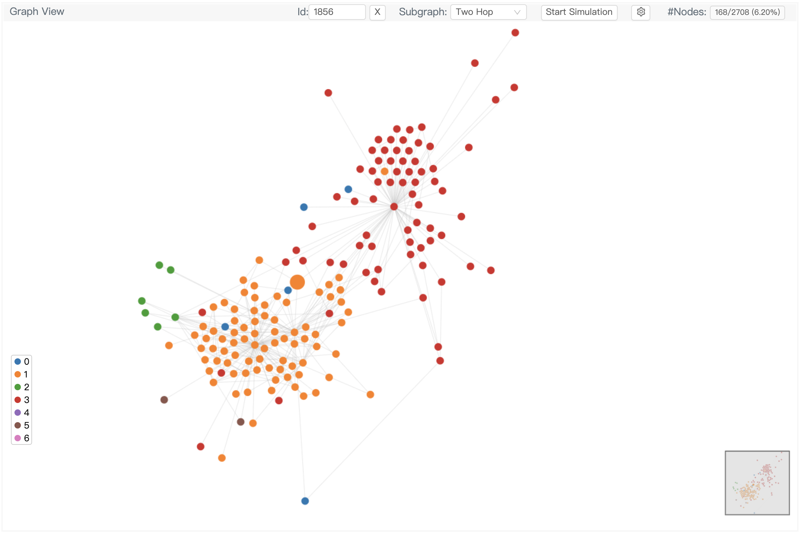
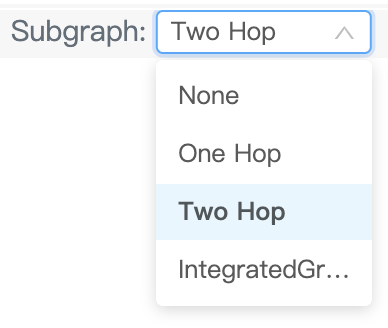
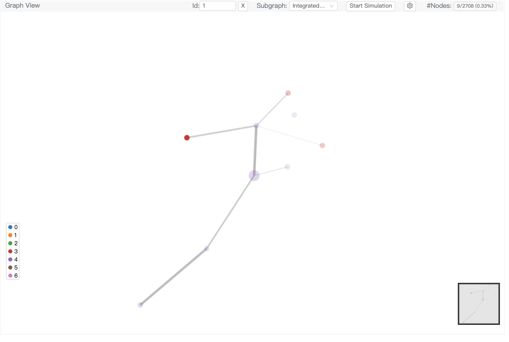

# Tutorial 4: Weighted subgraphs and explanation methods

Node-centered subgraphs play a critical role in analyzing GNNs. The k-hop subgraph of a node fully determines the information a k-layer GNN exploits to generate its final node representation. Many GNN explanation methods provide explanations by extracting a subgraph and assigning importance weights to the nodes and edges of it. GNNLens2 allows visualizing node-centered weighted subgraphs. This is beneficial for debugging and understanding GNNs and GNN explanation methods.

For this demonstration, we will use IntegratedGradients from [Captum](https://github.com/pytorch/captum) to explain the predictions of a graph convolutional network (GCN). Captum is a model interpretability and understanding library for PyTorch. You can install it with

```bash
pip install captum
```

## Data preparation

First, we load DGL’s built-in Cora dataset and retrieve its graph structure, node labels (classes) and number of node classes.

```python
import dgl
from dgl.data import CoraGraphDataset

dataset = CoraGraphDataset()
graph = dataset[0]
nlabels = graph.ndata['label']
num_classes = dataset.num_classes
```

We dump them to a local file that GNNLens2 can read.

```python
from gnnlens import Writer

# Specify the path to create a new directory for dumping data files.
writer = Writer('tutorial_subgraph')
writer.add_graph(name='Cora', graph=graph,
                 nlabels=nlabels, num_nlabel_types=num_classes)
```

We attribute the model predictions to the input node features with IntegratedGradients.

```python
import torch.nn as nn

from captum.attr import IntegratedGradients
from dgl.nn import GraphConv
from functools import partial

# Define a class for GCN
class GCN(nn.Module):
    def __init__(self,
                 in_feats,
                 num_classes):
        super(GCN, self).__init__()
        self.conv = GraphConv(in_feats, num_classes)

    def forward(self, h, g):
        # Interchange the order of g and h due to the behavior of partial
        return self.conv(g, h)

# Required by IntegratedGradients
h = graph.ndata['feat'].clone().requires_grad_(True)
model = GCN(h.shape[1], num_classes)
ig = IntegratedGradients(partial(model.forward, g=graph))
# Attribute the predictions for node class 0 to the input features
feat_attr = ig.attribute(h, target=0, internal_batch_size=graph.num_nodes(), n_steps=50)
```

We compute the node importance weights from the input feature weights and normalize them.

```python
import torch.nn.functional as F

node_weights = feat_attr.abs().sum(dim=1)
node_weights = (node_weights - node_weights.min()) / node_weights.max()
```

Extract 2-hop subgraphs of node 0 and 1 and dump them to a local file that GNNLens2 can read. The subgraph name corresponds to a group of subgraphs. In a subgraph group, each node can be associated with at most one subgraph. For each subgraph, we dump its node and edge IDs in the original graph and optionally subgraph node and edge weights.

```python
import dgl
import torch

def extract_subgraph(g, node):
    seed_nodes = [node]
    sg = dgl.in_subgraph(g, seed_nodes)
    src, dst = sg.edges()
    seed_nodes = torch.cat([src, dst]).unique()
    sg = dgl.in_subgraph(g, seed_nodes, relabel_nodes=True)
    return sg

graph.ndata['weight'] = node_weights
graph.edata['weight'] = torch.randn(graph.num_edges(),)
first_subgraph = extract_subgraph(graph, 0)
writer.add_subgraph(graph_name='Cora', subgraph_name='IntegratedGradients', node_id=0, 
                    subgraph_nids=first_subgraph.ndata[dgl.NID],
                    subgraph_eids=first_subgraph.edata[dgl.EID],
                    subgraph_nweights=first_subgraph.ndata['weight'],
                    subgraph_eweights=first_subgraph.edata['weight'])

second_subgraph = extract_subgraph(graph, 1)
writer.add_subgraph(graph_name='Cora', subgraph_name='IntegratedGradients', node_id=1,
                    subgraph_nids=second_subgraph.ndata[dgl.NID],
                    subgraph_eids=second_subgraph.edata[dgl.EID],
                    subgraph_nweights=second_subgraph.ndata['weight'],
                    subgraph_eweights=second_subgraph.edata['weight'])

# Finish dumping
writer.close()
```

## Launch GNNLens2

To launch GNNLens2, run the following command line.

```bash
gnnlens --logdir tutorial_subgraph
```

By entering `localhost:7777` in your web browser address bar, you can see the GNNLens2 interface. `7777` is the default port GNNLens2 uses. You can specify an alternative one by adding `--port xxxx` after the command line and change the address in the web browser accordingly.

## GNNLens2 Interface

After you select a graph and a node label option, you can click on an arbitrary node.

<p align="center">
  
</p>

You can enter node ID 1 in the Id box at the top and click on the subgraph drop-down list. The subgraph options now include `IntegratedGradients`. 

<p align="center">
  
</p>

After you select `IntegratedGradients`, GNNLens2 will display the subgraph you dumped earlier associated with node 1. GNNLens2 visualizes the importance weights of the nodes by opacity for node color.

<p align="center">
  
</p>

If you enter a node ID for which you did not dump a subgraph, it won’t display anything.

To terminate GNNLens2, use `ctrl + c`.
